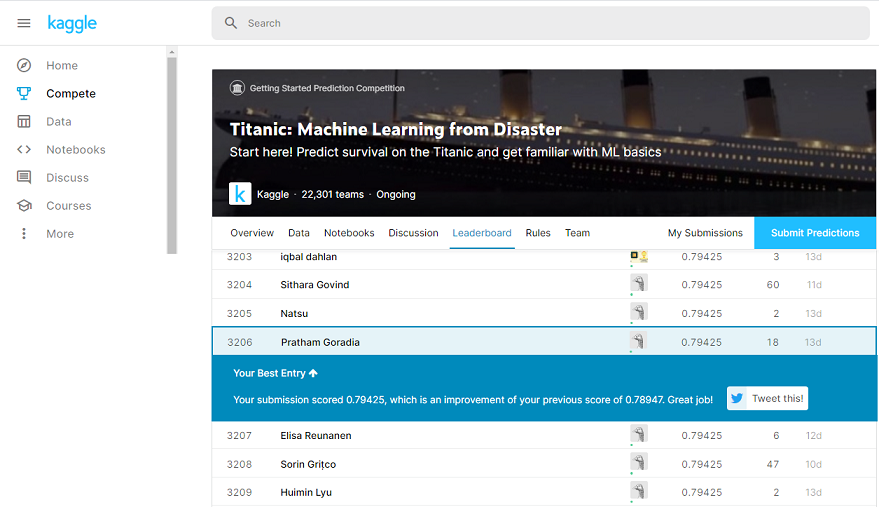

# titanic_MLCompetition
This repository contains the ipython notebook used to make my latest submission to Kaggle's Titanic Survivor Prediction Competition (Top 15%)\

**Please view the html version of this submission on this [link](http://prathamg.rf.gd/titanic.html)** \

\
Please view the html version of this submission on this [link](http://prathamg.rf.gd/titanic.html) \
Techniques used in developing this model:
* Exploratory Data Analysis
* Feature Generation
* Imputation of missing values
* Feature preprocessing
* Model implementation with parameter tuning
